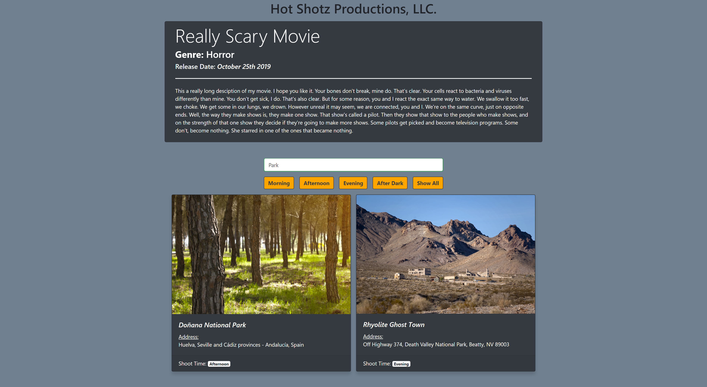
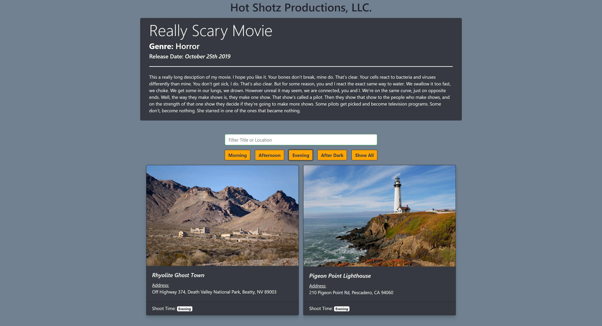

# Hot Shotz Productions, LLC

With this project we were tasked with building a website to track shooting locations for a new movie in the making. We were tasked to leverage JQuery requests to pull JSON data in from a file and handle all of our DOM manipulation and event handlers

## Screenshots

### Home Page with NO Filter


### Home Page with Location/Address Filter



### Home Page with Time of Day Filter



## Setup

**Your project should have (at least):**

```
|- db
    |- locations.json
    |- movie.json
|- javascripts
    |- events.js [Attaching all event listeners]
    |- main.js [Entry point/start application]
    |- components
        |- movieComponent.js [Writing to the dom for the movie component]
        |- locationComponent.js [Writing to the dom for the location components]
    |- data
      |- movieData.js [AJAX call for movie data]
      |- locationsData.js [AJAX call for locations data]
|- index.html
|- main.css
```

**Install via CDN:**

- jQuery (Full: Not the Bootstrap one)
- Bootstrap

## Requirements

- As a user, I want to see a listing of all available locations where I will shoot my movie. Each location should have a card that has all this data:

```
Image
Name: xxx
Address: xxx
Location: xxx
```

- There should be an input box to filter Name and Location.
- There should be buttons to filter for Time of Day

## Tech Requirements

- JQuery
- Bootstrap
- ES6 modules.
- Your code should be clean and readable, with single responsibility principle.

## How to run this project

- Use npm to install http-server in your terminal:

```sh
npm install -g http-server
```

- Run the server

```sh
hs -p 8080
```

- Open your browser and navigate to:

```
localhost:8080
```
